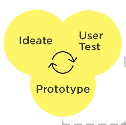
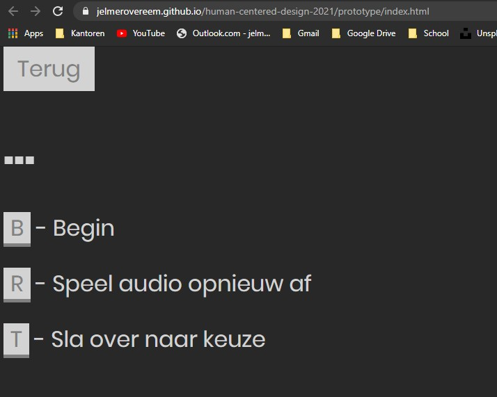

# AudioBook - Human Centered Design @cmda-minor-web · 2020/21

## 🔦 **Description**

Voor dit vak ga je een prototype maken speciaal gemaakt voor 1 persoon. Je product wordt tailor-made. Je gaat testen uitvoeren met deze speciale gebruiker, zo kom je er achter wat nou echt de behoeften zijn van deze gebruiker. Hiernaast leer je ook meer over het process van testen en itereren.  
  
[Bron](http://deckchair.co.uk/assets/uploads/2018/11/design-process.jpg)

## 🌐 **Live link**

Live link naar prototype: [https://jelmerovereem.github.io/human-centered-design-2021/prototype/index.html](https://jelmerovereem.github.io/human-centered-design-2021/prototype/index.html)



## 🚀 **Features**
- [x] Werkt volledig op spraak
- [x] Spraak is backed-up met toetscombinaties en buttons
- [x] Afspelen van audioboeken
- [x] Zelf opgenomen dus eigen stem

## 📝 **Process**
Mijn proces met een user scenario, testverslagen en een conclusie staan in de [wiki](https://github.com/Jelmerovereem/human-centered-design-2021/wiki) van deze repository.

## 📦 **NPM Packages**

There are no NPM Packages! So dependency free :)

## 💻 **Installation**

### Getting started

This project doesn't use any bundlers or dev servers. I would advice you to install [Browsersync](https://www.npmjs.com/package/browser-sync) to serve the web content in this project. You install Browsersync either through [NPM](https://www.npmjs.com), [Yarn](https://yarnpkg.com) or any other NPM package manager of choice with global installation functionality.

```shell
$ npm install --global browser-sync || yarn global add browser-sync
```

### Then proceed to clone this repository.

```bash
  git clone https://github.com/Jelmerovereem/human-centered-design-2021
```

### Navigate to the project folder

```bash
  cd human-centered-design-2021
  cd prototype
```

### Start server

```bash
 browser-sync start --server --watch
```

## 🔍 **Sources**
* MDN. (Apr 20, 2021). SpeechRecognition - Web APIs | MDN. [https://developer.mozilla.org/en-US/docs/Web/API/SpeechRecognition](https://developer.mozilla.org/en-US/docs/Web/API/SpeechRecognition)
* van Gemert, V. (n.d.). The Exclusive Design Principles. Vasilis.Nl. https://exclusive-design.vasilis.nl/principles/


## 🔐 **License**
Dit is een project met een [MIT](https://github.com/Jelmerovereem/human-centered-design-2021/blob/master/LICENSE) licentie. Gemaakt door Jelmer Overeem.

<!-- Here are some hints for your project! -->

<!-- Start out with a title and a description -->

<!-- Add a link to your live demo in Github Pages 🌐-->

<!-- ☝️ replace this description with a description of your own work -->

<!-- replace the code in the /docs folder with your own, so you can showcase your work with GitHub Pages 🌍 -->

<!-- Add a nice image here at the end of the week, showing off your shiny frontend 📸 -->

<!-- Maybe a table of contents here? 📚 -->

<!-- How about a section that describes how to install this project? 🤓 -->

<!-- ...but how does one use this project? What are its features 🤔 -->

<!-- What external data source is featured in your project and what are its properties 🌠 -->

<!-- This would be a good place for your data life cycle ♻️-->

<!-- Maybe a checklist of done stuff and stuff still on your wishlist? ✅ -->

<!-- How about a license here? 📜  -->